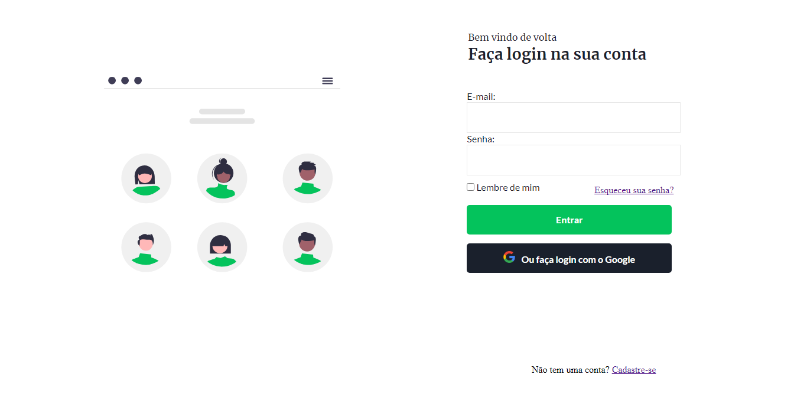

# Tela de Login - HTML, CSS e JS

Este repositório contém um projeto de um template de tela de login desenvolvido com HTML, CSS e JavaScript. O objetivo deste projeto é criar um design responsivo e intuitivo para uma tela de login, fornecendo um ponto de partida para a implementação de funcionalidades de autenticação em projetos web.

- Está em desenvolvimento : <a href="https://login-page-projeto.netlify.app">Link</a>

## Descrição

O template de tela de login é um projeto simples desenvolvido para praticar habilidades em HTML, CSS e JavaScript. Ele foi projetado para fornecer uma estrutura básica para a criação de uma tela de login, incluindo campos de entrada para usuário e senha, botão de login e opções de recuperação de senha.

## Funcionalidades

- Campo de entrada para usuário
- Campo de entrada para senha
- Botão de login
- Link de recuperação de senha

## Tecnologias Utilizadas

- HTML5
- CSS3
- JavaScript

## Como Usar

1. Clone ou faça o download deste repositório para o seu ambiente local.

2. Abra o arquivo `index.html` em um navegador da web.

3. Explore o template da tela de login e visualize o design responsivo em diferentes dispositivos.

4. Utilize o código HTML, CSS e JavaScript fornecido como base para implementar as funcionalidades de autenticação no seu próprio projeto.

## Contribuindo

Este projeto foi criado com o propósito de estudo e, portanto, não são aceitas contribuições externas neste momento.

## Licença

Este projeto é apenas para fins de estudo e não possui uma licença específica.

## Contato

Se você tiver alguma dúvida ou precisar entrar em contato, pode me encontrar no [GitHub](https://github.com/seu-usuario-github).

Espero que este readme seja útil para você! Se tiver mais alguma pergunta, estou à disposição para ajudar.

